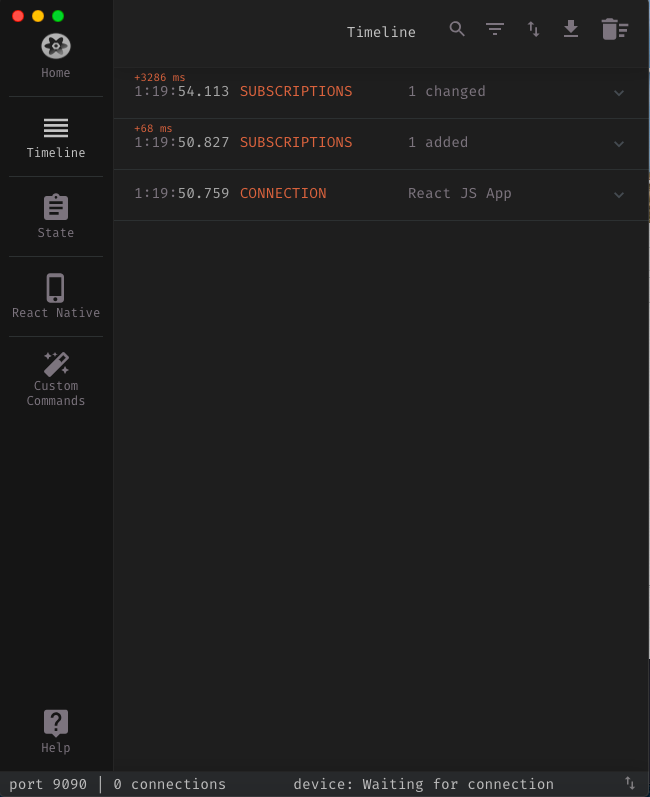
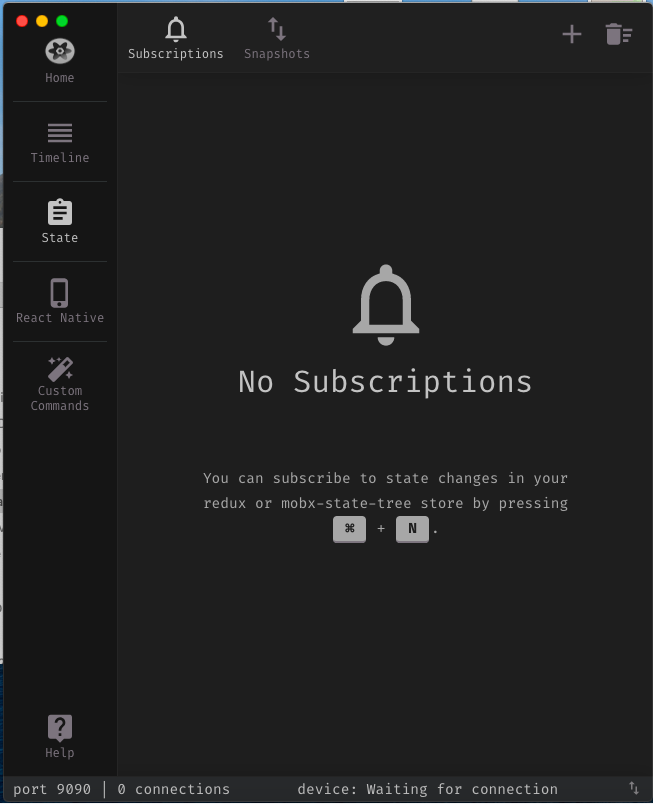
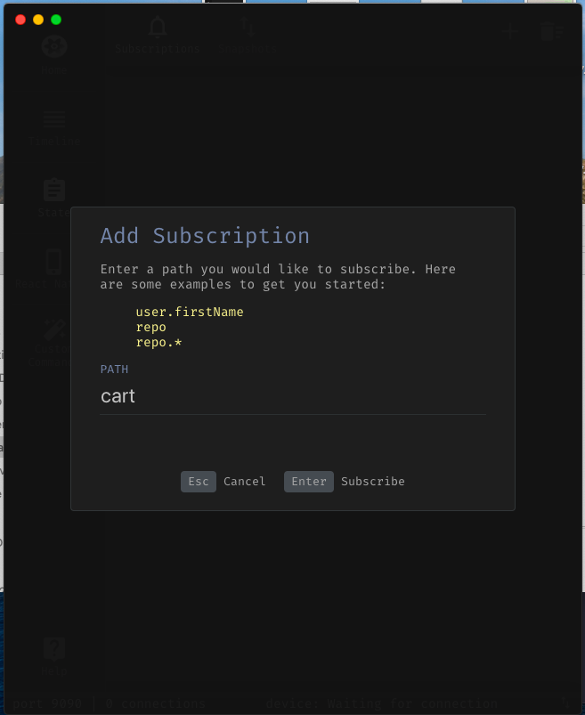
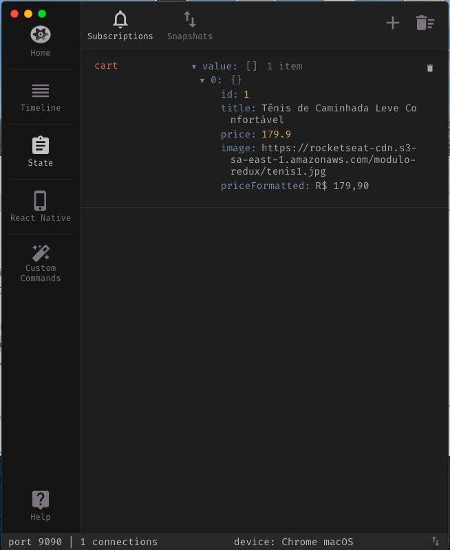
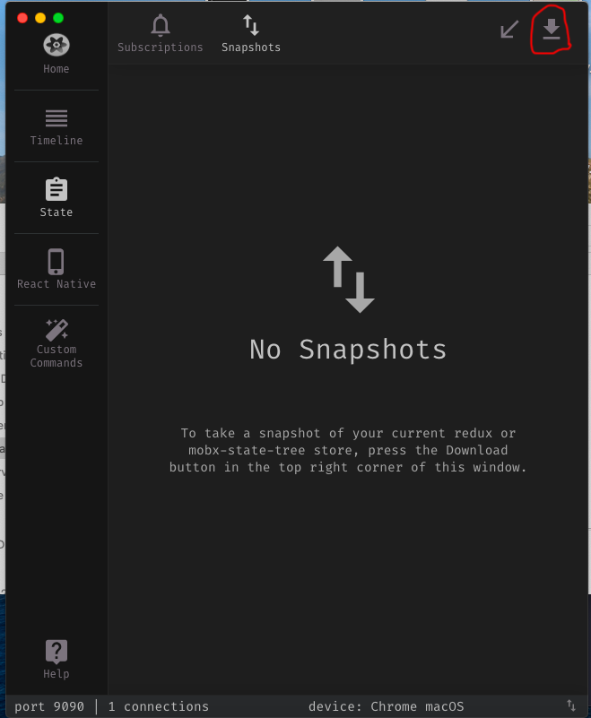
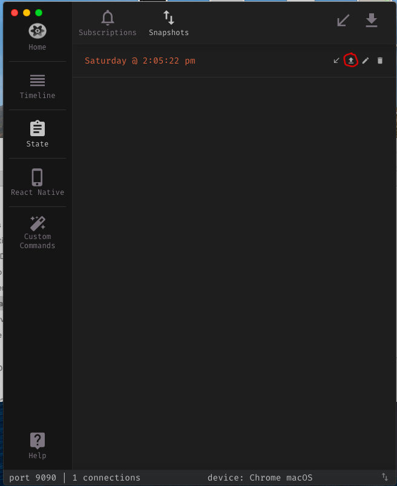

<h1>React com redux parte 6 - Ractotron</h1>

- Baixar de [Reactotron](https://github.com/infinitered/reactotron/releases)

- Baixar a versão mais recente não beta.

- No projeto instalar as dependencias:

```bash
yarn add reactotron-react-js reactotron-redux
```

- Criar um arquivo `src/config/ReactotronConfig.js` add o seguinte conteudo:

```js
import Reactotron from 'reactotron-react-js';
import { reactotronRedux } from 'reactotron-redux';

if (process.env.NODE_ENV === 'development') {
  const tron = Reactotron.configure()
    .use(reactotronRedux())
    .connect();

  tron.clear();

  console.tron = tron;
}
```

- o `process.env.NODE_ENV` sempre será `development` quando executarmos `yarn start`, porém quando for no `build`,
não irá executar o conteúdo do if.

- Para remover o e erro do eslint do `console.tron`, adicione o seguinte nas rules do `.eslintrc.js`


```js
'no-console': ["error", { allow: ["tron"] }]
```
---

<h2>Integrando o Redux com o Ractotron</h2>

- No arquivo `src/store/index.js` alterar:

```js
const enhancer = process.env.NODE_ENV === 'development' ? console.tron.createEnhancer() : null;

const store = createStore(rootReducer, enhancer);

```

- E no arquivo `src/App.js` adicionar a importação do `config/ReactotronConfig` é importante que ela venha antes da importação do `store`


---

<h2>Detalhes sobre a aplicação Reactotron</h2>

- Com Reactron podemos monitorar as actions:



- acompanhar uma variável do state:







- Salvar snapshot para resgatar depois que recarregar a página por exemplo.:





